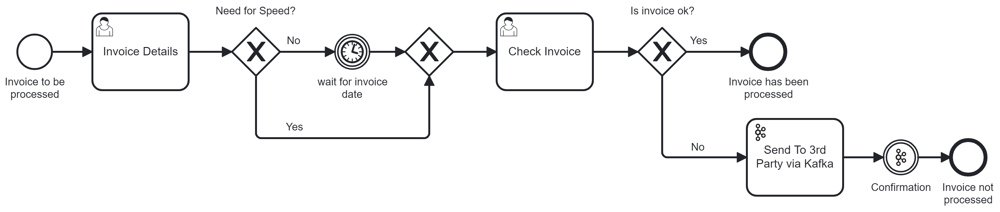

# Invoice Kafka Process Example

This is a simple enough example project for Camunda 8 which shows how you can process an invoice between end users and then at the end send and receive Kafka messages.

## Credentials and Account Creation

You’ll need a Kafka instance running. (the easiest place to do that is [confluent.cloud](https://confluent.cloud/)). You’ll need a Camunda 8 Cluster (the easiest place to do that is [Camunda SaaS](https://signup.camunda.com/accounts)). Then the fun can start.

Connecting the two systems requires authentication, and from your Kafka instance you’ll need the following:

- **Username** - You’ll get this from creating an API Key for your Kafka instance
- **Password** - Same as the username, it’s part of the API Key creation
- **Bootstrap** **Server** - After you create a Kafka cluster you’ll find this in the cluster settings.

🔐 It’s important to know that it’s best practice not to simply copy and paste this sensitive information directly into the model but rather to [create a secret](https://docs.camunda.io/docs/components/console/manage-clusters/manage-secrets/) for each of these in your Camunda cluster. Then you can reference it by typing `{{secrets.yourSecretHere}}` followed by the name of the key you want to access.

For this example to work you'll need to create secrets with the following names:

- KafkaUsername
- KafkaPassword
- KafkaBootstrapServer

Now you’re ready to upload and deploy the process.

## Deploy and Start

Once you have both accounts, it's pretty easy to get started. Upload the BPMN model and the Forms from their respective folders and add them to your Camunda 8 account. From the modeler you can deploy the process to a cluster.

You can start the process from the Modeler or from Tasklist.
